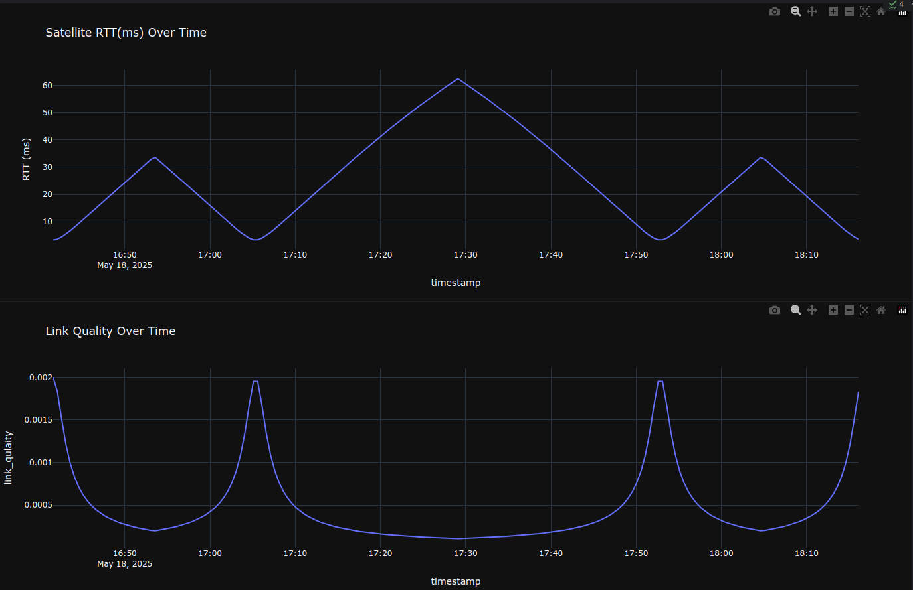

# Satellite Communication Data Simulation & Analysis Demo

[](#)

## Table of Contents

- [Project Overview](#project-overview)
- [Features](#features)
- [Prerequisites](#prerequisites)
- [Installation](#installation)
- [Usage](#usage)
- [Project Structure](#project-structure)
- [Data Description](#data-description)
- [Scripts Explained](#scripts-explained)
- [Visualization](#visualization-examples)
---

## Project Overview

Simulate a Low Earth Orbit (LEO) satellite’s trajectory and analyze key network performance indicators (KPIs) such as round-trip latency, handover events, and link quality over time. This demo illustrates:

- Generating synthetic orbital pass data
- Modeling network metrics based on satellite-ground station geometry
- Visualizing trends with interactive plots
- Structuring reproducible research workflows

---

## Features

- Circular-orbit simulation with configurable altitude and period
- Automatic computation of RTT (latency) and link quality per sample
- Handover detection across multiple ground stations
- Interactive data analysis in Jupyter Notebook using Plotly

---

## Prerequisites

- Python 3.9+
- Git

---

## Installation

1. Clone the repository:
   ```bash
   git clone git@github.com:Jiso-Chacko/Satellite-Communication-Data-Simulation-Analysis.git
   cd Satellite-Communication-Data-Simulation-Analysis 
   ```
2. Create and activate a virtual environment:
   ```bash
   python3 -m venv venv
   source venv/bin/activate
   ```
3. Install Python dependencies:
    ```bash
   pip install -r requirements.txt
   ```
---

## Usage

1. Generate Orbital Pass Data:
   ```bash
   python scripts/generate_passes.py
   ```
2. Compute Network KPIs:
   ```bash
   python scripts/compute_kpis.py
   ```
3. Analyze & Visualize:
    ```bash
   jupyter notebook notebooks/analysis.ipynb
   ```
---
## Project Structure

- `data/` - Contains all data files, both raw and processed
- `notebooks/` - Jupyter notebooks for analysis and visualization
- `scripts/` - Source code for data generation and processing
---

## Data Description

### Satellite Position Data (simulated_passes.csv)
- `timestamp`: Time of observation
- `x_km`, `y_km`, `z_km`: 3D coordinates relative to Earth's center

### Network KPIs (kpis.csv)
- `timestamp`: Time of measurement
- `closest_gs`: Currently connected ground station
- `latency_ms`: Round-trip time in milliseconds
- `link_quality`: Signal quality metric
- `handover`: Binary indicator of ground station switches
---

## Visualization Examples

### 3D Orbital Trajectory

*Visualization of the satellite's orbital path and ground station locations*

### Round Trip Time Analysis

*Round-trip time (latency) analysis across the orbital period*

### Handover Events

*Ground station handover events during satellite passes*

### Distribution and Correlation Analysis

*Statistical distribution and correlation analysis of network metrics*

---
